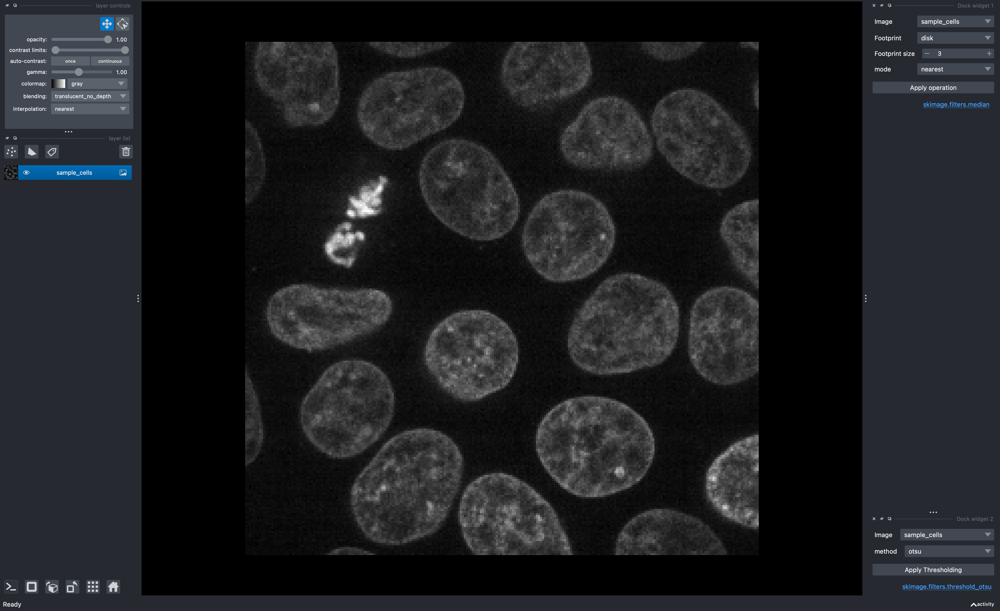

---
jupytext:
  formats: ipynb,md:myst
  text_representation:
    extension: .md
    format_name: myst
    format_version: 0.13
    jupytext_version: 1.16.4
kernelspec:
  display_name: Python 3 (ipykernel)
  language: python
  name: python3
---

# Basic image processing with napari

```{code-cell} ipython3
!pip install git+https://github.com/guiwitz/napari-skimage.git
```

```{code-cell} ipython3
import napari
from napari.utils import nbscreenshot
from napari_skimage.skimage_filter_widget import median_filter_widget
from napari_skimage.skimage_threshold_widget import threshold_widget
from skimage import data

# Load a sample 3D grayscale image (like cells)
viewer = napari.Viewer()
sample_image = data.cells3d()[30, 1]  # This will load a sample grayscale image from skimage
image_layer = viewer.add_image(sample_image, name='sample_cells')

# Create the widgets without parameters
laplace_widget = median_filter_widget()
threshold_widget_instance = threshold_widget()

# Add the widgets to the viewer's dock
viewer.window.add_dock_widget(laplace_widget, area='right')
viewer.window.add_dock_widget(threshold_widget_instance, area='right')

# Capture the screenshot for the notebook
screenshot = nbscreenshot(viewer)
screenshot
```

A screenshot can be seen here 

```{code-cell} ipython3
from PIL import Image
import numpy as np

# Assuming 'screenshot' is your NumPy array from nbscreenshot(viewer)
image = Image.fromarray(screenshot.image)

# Save the image
image.save('./resources/napari_skimage.png')
```
