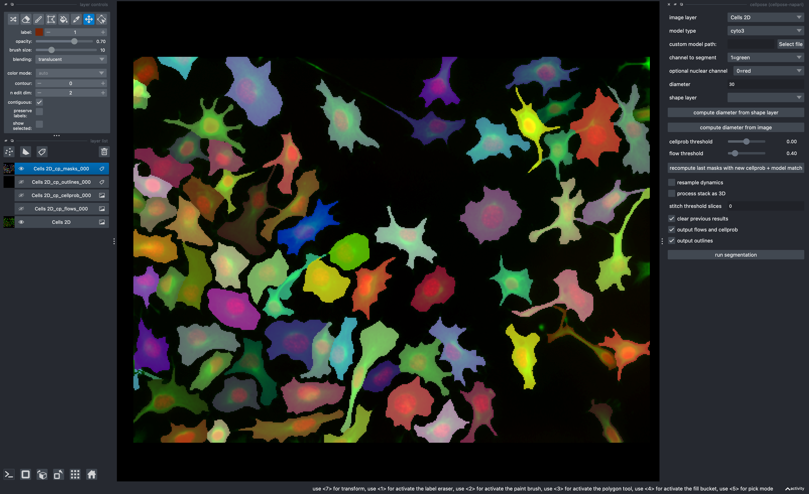
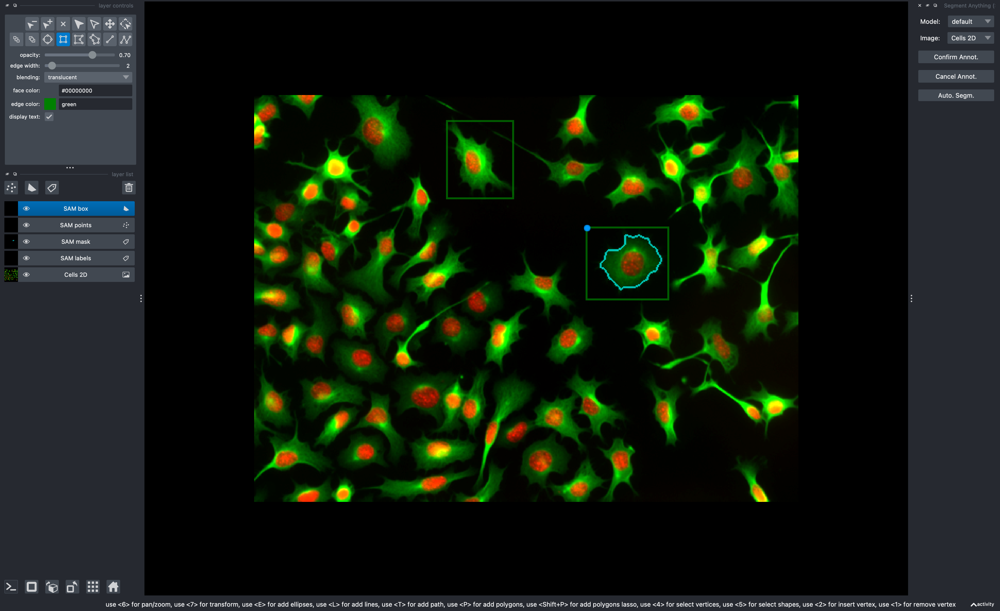
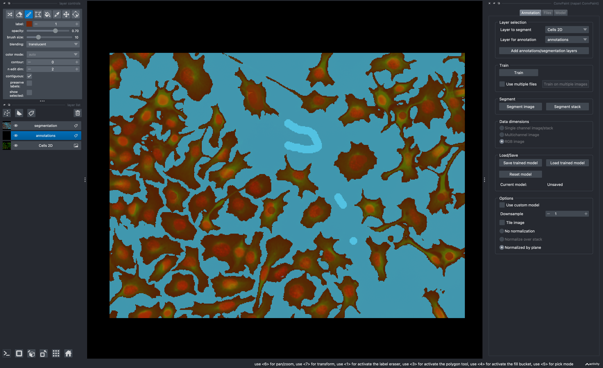
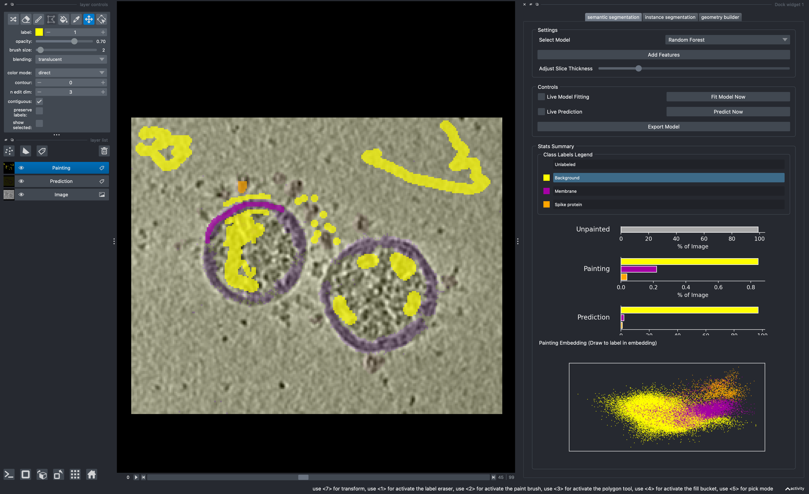

---
jupytext:
  formats: ipynb,md:myst
  text_representation:
    extension: .md
    format_name: myst
    format_version: 0.13
    jupytext_version: 1.16.4
kernelspec:
  display_name: Python 3 (ipykernel)
  language: python
  name: python3
---

# DL in napari

+++

## Some DL in napari plugins

- [StarDist](https://github.com/stardist/stardist-napari)
- [Cellpose](https://github.com/MouseLand/cellpose-napari)
- [napari-convpaint](https://github.com/guiwitz/napari-convpaint)
- [napari-segment-anything](https://github.com/royerlab/napari-segment-anything)
- [napari-segment-anything-2](https://github.com/JoOkuma/napari-segment-anything-2)
- [cellcanvas](https://cellcanvas.org/)

+++

## Stardist

For a comprehensive overview of stardist in napari check out this [workshop tutorial](https://kephale.github.io/napari-workshop-halfway-to-i2k/notebooks/segmenting_and_measuring_nuclei_stardist.html)

+++

## Cellpose



From Carsen Stringer's group at HHMI Janelia Research Campus.

For more info see [here](https://github.com/MouseLand/cellpose-napari).

Steps:

1. File > Open Sample > cellpose-napari > Cells 2D
2. Plugins > cellpose
3. Check cellpose options in screenshot to repeat

```{code-cell} ipython3
# !pip install git+https://github.com/MouseLand/cellpose-napari
```

## Segment anything



From Jordão Bragantini of the Royer lab, CZ Biohub

For more info see [here](https://github.com/royerlab/napari-segment-anything)

```{code-cell} ipython3
# !pip install git+https://github.com/royerlab/napari-segment-anything.git@fix-napari-colors
```

## napari-convpaint



[napari-convpaint](https://github.com/guiwitz/napari-convpaint) by Guillaume Witz for interactive segmentation using pretained NN models.

```{code-cell} ipython3
# !pip install git+https://github.com/guiwitz/napari-convpaint.git
```

## CellCanvas



CellCanvas is a tool made by [Kyle Harrington](https://kyleharrington.com) and [Kevin Yamauchi](https://kevinyamauchi.github.io/) along with more collaborators like Lorenz Lamm, Kevin Zhao, and Utz Ermel.

[Example data](https://www.dropbox.com/scl/fi/dpxm20jjyj7j95u9qpdei/cropped_covid.zarr.zip?rlkey=5jzdkvqnyyxqtbc5b682eo5s6&dl=0)

```{code-cell} ipython3
# !pip install git+https://github.com/cellcanvas/cellcanvas.git@dl-at-mbl-2024
```

```{code-cell} ipython3
import napari

viewer = napari.Viewer()
```
